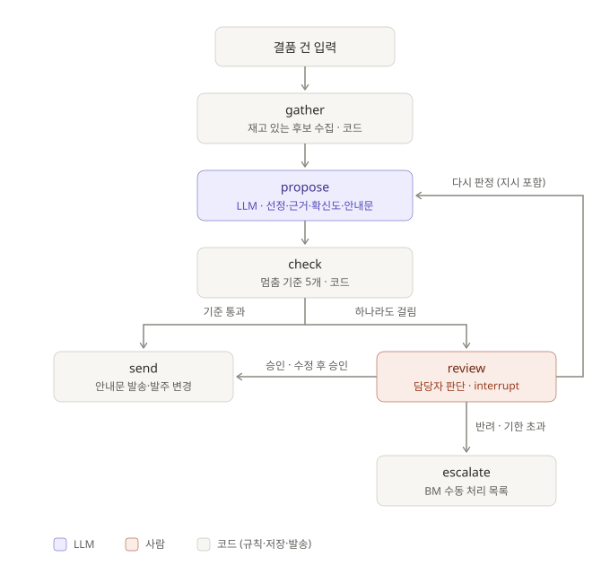
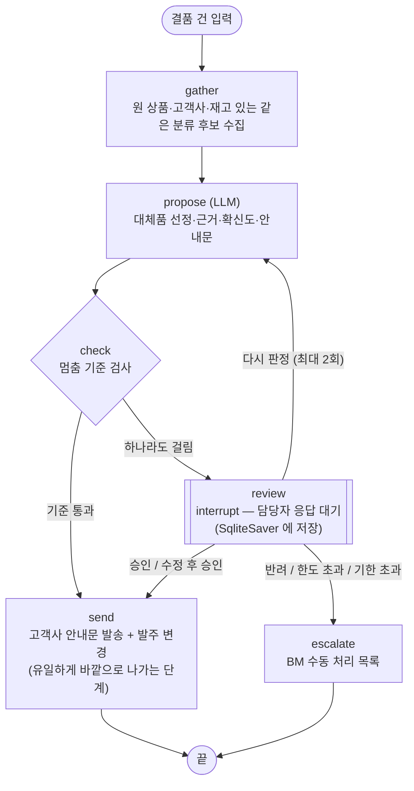
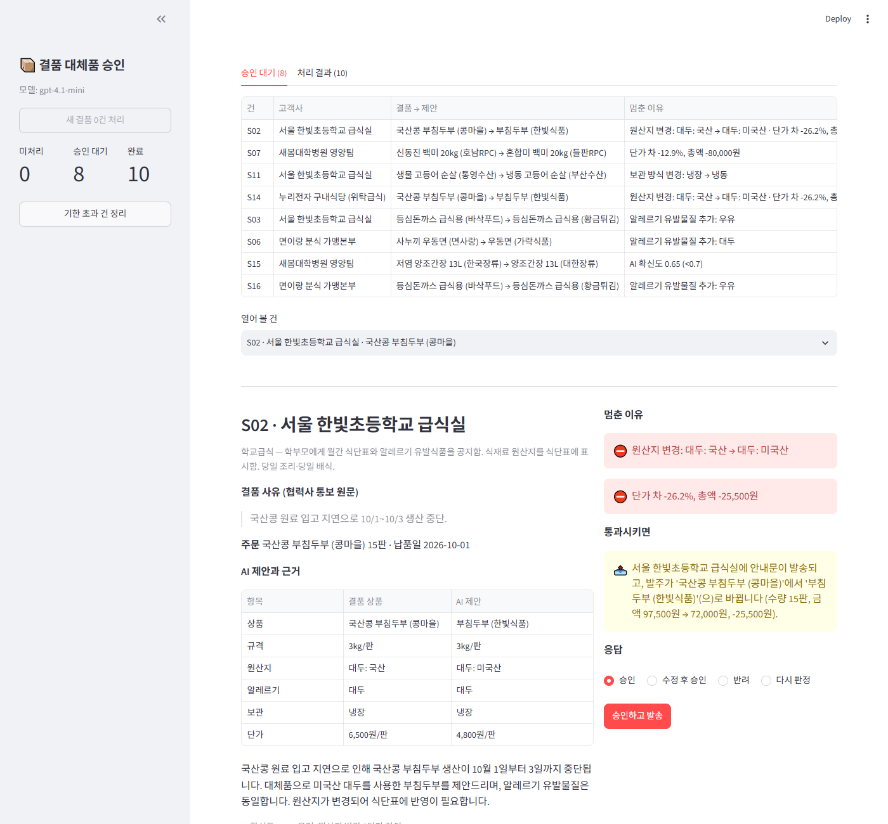
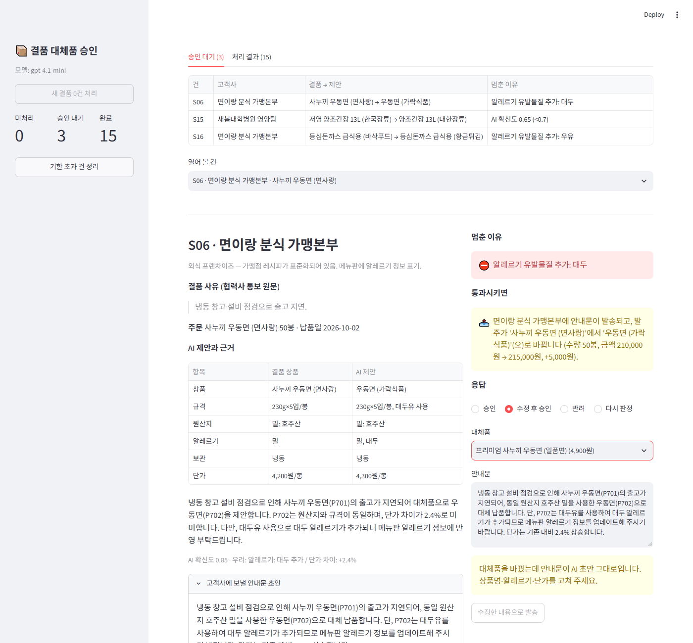
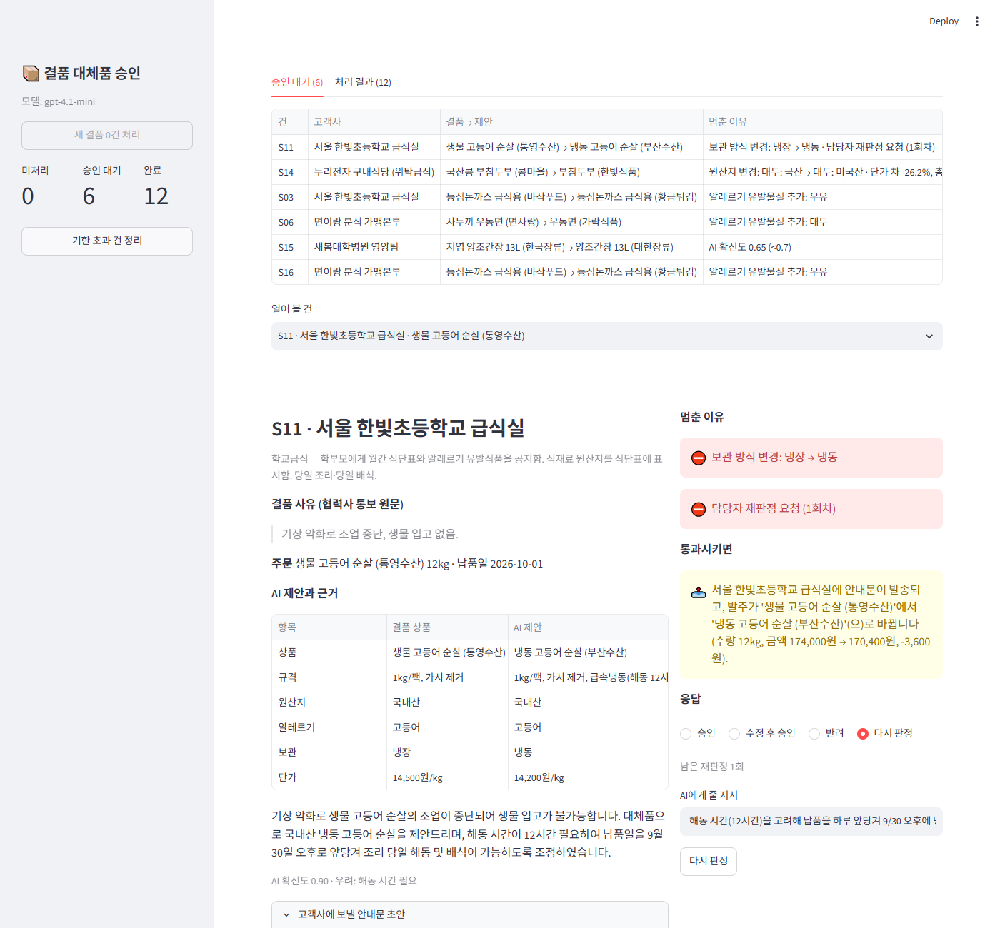
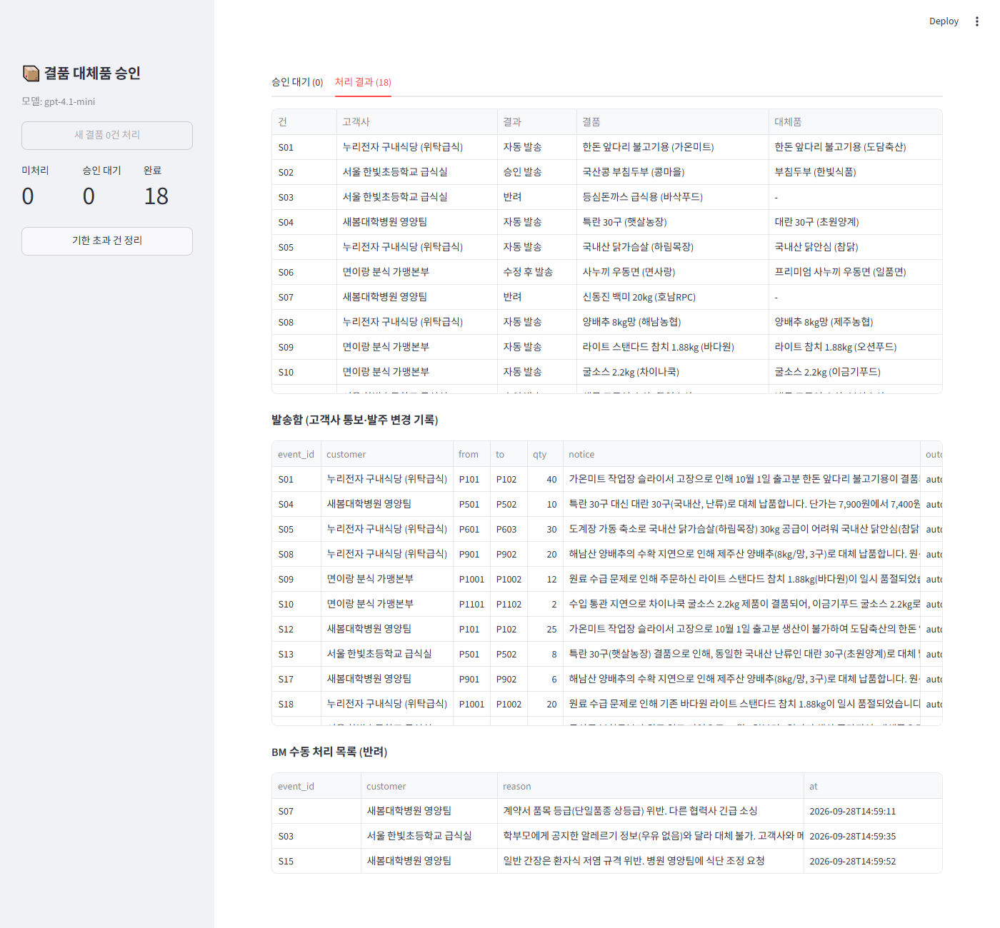

# REPORT — 결품 대체품 승인 에이전트

## 1. 주제와 고른 이유

**업무**: 식자재 유통사(B2B) BM 이 협력사 결품을 처리하는 일. 급식·외식 고객사의 주문 상품이 협력사 사정(설비 고장, 원료 입고 지연, 기상 악화)으로 결품되면 재고가 있는 대체품을 골라 고객사에 안내하고 발주를 바꾼다.

**고른 이유**
- 결품은 매일 여러 건 생기고 대부분은 동등품으로 바꾸면 끝나는 일이라 자동화 이득이 크다.
- 그런데 일부는 한 번 나가면 되돌릴 수 없다. 학교 급식에 우유가 든 돈까스가 들어가면 학부모에게 공지한 알레르기 정보가 틀려지고, 수입콩 두부가 들어가면 식단표 원산지 표시가 틀려진다. 병원 저염식에 일반 간장이 들어가는 것도 마찬가지다.
- 건마다 위험 크기가 달라 **일부만 사람이 보면 되는** HITL 에 맞는 업무다.

**결과가 바깥으로 나가는 단계**: 고객사에 대체품 안내문을 보내고 발주를 바꾸는 `send` 노드. 이 데모에서는 실제 시스템 대신 `runtime/outbox.jsonl` 에 기록한다. 반려하면 고객사에는 아무것도 나가지 않고 `runtime/escalations.jsonl`(BM 수동 처리 목록)에 올라간다.

> 데이터는 합성이다. 상품 28종(분류 12개), 고객사 4곳(학교·병원·기업 구내식당·외식 프랜차이즈), 결품 18건. 결품마다 "사람이 봐야 하나" 정답과 이유를 직접 붙였다(`data/stockouts.json`).

## 2. 파이프라인 구조

LLM 은 `propose` 한 곳에서만 쓰인다. 처음 판단할 때와 담당자가 다시 판정을 시킬 때 불리며, 후보 중 대체품을 고르고 근거·확신도·우려점·고객사 안내문을 정해진 형식으로 낸다. 멈출지는 LLM 이 아니라 `check` 의 규칙이 정하고, LLM 확신도는 그 규칙 중 하나로만 쓰인다. 승인·반려와 발송에는 LLM 이 관여하지 않는다.

Mermaid 코드 (노드 설명 포함)

**State**

| 키 | 채우는 노드 | 내용 |
|---|---|---|
| `event` | 입력 | 결품 건 (고객사, 상품, 수량, 납품일, 협력사 통보 원문) |
| `customer`, `original`, `candidates` | gather | 고객사 정보, 결품 상품, 재고 있는 같은 분류 후보 |
| `proposal` | propose, review(수정) | `substitute_id`, `reason`, `confidence`, `concerns`, `notice` |
| `stop_reasons` | check | 걸린 기준의 사유 목록 (비면 자동 통보) |
| `decision`, `retry_count`, `instruction` | review | 담당자 응답, 다시 판정 횟수와 지시 |
| `outcome`, `sent` | send, escalate | `auto_sent` · `approved_sent` · `edited_sent` · `rejected` |

**멈추고 이어가기**
- `thread_id` = 결품 건 ID. 건마다 체크포인트가 따로 쌓여 대기 건이 여러 개여도 섞이지 않는다.
- 체크포인터는 `SqliteSaver`(`runtime/checkpoints.sqlite`). 담당자가 다음 날 답해도 되도록 파일에 둔다. 프로그램을 껐다 켠 뒤에도 대기 건을 이어서 처리하는 것을 테스트로 확인했다(`test_pending_case_survives_restart`).
- 승인 대기 목록은 `get_state(thread).next` 가 비어 있지 않은 건이다.
- 재개하면 `review` 노드가 처음부터 다시 실행되므로, 그 안에서 `interrupt` 전에 바깥으로 나가는 동작을 두지 않았다. 발송은 `send` 노드에만 있다.

**응답 네 가지와 그 뒤에 일어나는 일**

| 응답 | 이후 |
|---|---|
| 승인 | AI 안내문 그대로 발송 |
| 수정 후 승인 | 대체품(다른 후보)·안내문을 고친 내용으로 발송 |
| 반려 (사유 필수) | 고객사에는 아무것도 보내지 않고 BM 수동 처리 목록으로. 사유는 기준을 고칠 재료 |
| 다시 판정 (지시 입력) | 지시를 붙여 LLM 이 다시 고른다. 결과는 기준과 상관없이 다시 사람에게 온다. 2회를 넘기면 반려 |

**운영 규칙**: 승인 기한은 **납품 전날 17시**. 넘긴 대기 건은 "기한 초과 건 정리"(`expire_overdue`)로 자동 반려해 BM 이 직접 처리한다. 멈춘 건은 위험하다고 판단된 건이므로 자동 승인하지 않는다.

## 3. 승인 기준과 그 이유

| 기준 | 계산식 | 막으려는 위험 |
|---|---|---|
| 알레르기 추가 | 대체품 알레르기 유발물질 중 원 상품에 없는 것이 하나라도 있음 | 학교 식단표·가맹점 메뉴판에 공지한 알레르기 정보가 틀려져 식품 사고로 이어짐 |
| 원산지 변경 | 원산지 문자열이 다름. 단 국내산 안에서 산지만 바뀐 경우(해남 → 제주)는 제외 | 집단급식소는 원산지를 식단표·배식대에 표시한다. 바뀌면 표시 위반 |
| 보관 방식 변경 | 냉장 ↔ 냉동 ↔ 실온이 다름 | 냉동품은 해동 시간(12시간)이 필요해 당일 조리 일정이 어긋나고, 보관 설비도 다름 |
| 단가·총액 | \|단가 차\| > 10% **이고** \|총액 차\| ≥ 10,000원 | 계약 단가와 크게 달라 고객사 정산·원가에 영향. 총액 차가 작으면 볼 가치가 없음 |
| AI 확신도 | `confidence` < 0.7 | 규칙으로 못 잡는 차이(저염 같은 기능성 규격, 계약 등급)를 AI 가 확신하지 못한 것으로 잡음 |
| (자동) 대체품 없음 | 후보가 없거나 AI 가 NONE | 보낼 것이 없음 |

**자동으로 처리되는 건과 사람이 안 봐도 되는 이유**: 원산지·알레르기·보관 방식이 같고 단가 차가 작은 **동등품**이다. 예: 같은 국내산 앞다리 불고기용을 다른 협력사 제품으로(S01, +4.2%), 특란 → 대란(S04), 양배추 산지만 해남 → 제주(S08), 같은 규격 참치캔(S09). 고객사가 식단표·메뉴판·조리 일정 어느 것도 고칠 필요가 없어서 사람이 확인해도 바뀌는 것이 없다.

### 기준을 검증한 과정

`python evaluate.py` — 같은 18건에 기준 조합을 바꿔 가며 개입률·놓침·헛멈춤을 센다. 정답은 AI 가 고른 대체품 기준이다(국내산 대신 수입산을 고르면 멈춰야 하는 것이 정답).

| 멈춤 기준 | 개입률 | 놓침 | 헛멈춤 | 놓친 건 | 헛멈춘 건 |
|---|---|---|---|---|---|
| 기준 없음 (전부 자동) | 0/18 | 9 | 0 | S02, S03, S05, S06, S07, S11, S14, S15, S16 | - |
| 단가 ±10% | 5/18 | 5 | 1 | S03, S06, S11, S15, S16 | S10 |
| 알레르기 + 원산지 | 6/18 | 3 | 0 | S07, S11, S15 | - |
| 알레르기 + 원산지 + 단가 | 8/18 | 2 | 1 | S11, S15 | S10 |
| 알레르기 + 원산지 + 확신도 | 7/18 | 2 | 0 | S07, S11 | - |
| **v1**: 알레르기 + 원산지 + 단가 + 확신도 | 9/18 | 1 | 1 | S11 | S10 |
| v1 + 보관 방식 | 10/18 | 0 | 1 | - | S10 |
| **v2 (채택)**: v1 + 보관 방식, 단가는 총액 1만 원 이상만 | 9/18 | **0** | **0** | - | - |
| v2 에서 확신도 뺌 | 8/18 | 1 | 0 | S15 | - |
| 전부 멈춤 | 18/18 | 0 | 9 | - | 자동 대상 9건 전부 |

(`output/criteria_eval.md`, 모델 gpt-4.1-mini, temperature 0)

- **v1 에서 시작했다.** 규칙 셋(알레르기·원산지·단가)에 AI 확신도를 더한 안. 놓침 1(S11), 헛멈춤 1(S10).
- **S11 놓침**: 학교에 생물 고등어 대신 냉동 고등어. AI 는 "원산지·알레르기 동일, 단가 저렴"이라며 확신도 0.85 를 줬다. 해동 12시간이 규격에 적혀 있고 고객사 정보에 "당일 조리"가 있는데도 못 잡았다. → **보관 방식 기준 추가**.
- **S10 헛멈춤**: 굴소스 단가 +13.3% 지만 2병, 총 3,200원 차이. → **단가 기준에 총액 1만 원 하한**.
- **확신도 기준은 빼면 안 된다.** 빼면 S15(병원 저염 간장 → 일반 간장)를 놓친다. 이 건은 규칙 어디에도 안 걸리고 AI 확신도(0.65)만 잡는다.
- 놓침을 헛멈춤보다 비싸게 봤다. 놓침은 식품 사고·표시 위반이고, 헛멈춤은 담당자 10초다.

**LLM 판단을 믿지 않고 규칙을 둔 근거 (실행에서 본 것)**
- 알레르기가 추가된 S03·S06·S16 에 AI 는 확신도 0.85 를 줬다. 확신도만으로는 한 건도 못 잡는다.
- S06 에서 AI 근거는 "알레르기 유발물질은 밀로 동일"이라고 쓴 뒤 "대체품은 대두유가 추가로 포함"이라고 이어 썼다. 스스로 모순된 근거다.
- 같은 설정(temperature 0)에서도 실행마다 달랐다. S05 는 한 번은 국내산 닭안심(P603), 한 번은 브라질산(P602)을 골랐고, S07 확신도는 0.65 → 0.75 로 바뀌어 확신도 기준을 넘나들었다. S07 은 v2 의 단가·총액 기준이 따로 잡는다.

**한계**: v2 는 이 18건을 보고 고친 기준이라 이 18건에서 0/0 이 나오는 것은 당연하다. 강의에서 말한 대로 실제 업무에서 놓침·헛멈춤을 동시에 0 으로 만드는 기준은 거의 없다. 새 결품 데이터로 다시 재야 하고, 반려 사유를 모아 기준을 고치는 재료로 쓴다.

## 4. 실행 결과

Streamlit 데모에서 결품 18건을 처리했다(gpt-4.1-mini, 채택 기준 v2). 담당자 응답은 데모를 위해 제가 BM 역할로 네 가지 응답을 골고루 써서 넣었다.

| 구분 | 건수 | 건 |
|---|---|---|
| 자동 통보 | 10 | S01, S04, S05, S08, S09, S10, S12, S13, S17, S18 |
| 사람에게 멈춤 | 8 | S02, S03, S06, S07, S11, S14, S15, S16 |

멈춘 8건은 정답 라벨의 "멈춤" 8건과 같았고, 자동 10건은 모두 정답이 "자동"이었다.

**멈춘 건을 사람이 처리한 방법**

| 건 | 멈춘 이유 | 응답 | 처리 |
|---|---|---|---|
| S02 학교 두부 | 원산지 국산 → 미국산, 총액 -25,500원 | 승인 | AI 안내문이 "식단표에 원산지 변경 반영 부탁"을 이미 담고 있어 그대로 발송 |
| S14 구내식당 두부 | 원산지 국산 → 미국산, 총액 -68,000원 | 승인 | 배식대 원산지 게시 변경 요청이 안내문에 있어 발송 |
| S06 분식 우동면 | 알레르기 추가: 대두 | 수정 후 승인 | 대두 없는 프리미엄 우동면(+16.7%)으로 바꾸고 안내문을 새로 씀. "차액은 당사 부담" 명시 |
| S16 분식 돈까스 | 알레르기 추가: 우유 | 수정 후 승인 | 대체품은 유지하고 "메뉴판 알레르기 표기에 우유 추가" 문구를 덧붙여 발송 |
| S11 학교 고등어 | 보관 방식 냉장 → 냉동 | 다시 판정 → 승인 | "해동 시간 고려해 하루 앞당겨 9/30 오후 납품" 지시 → AI 가 납품일 변경 안내문으로 다시 씀 → 승인 |
| S03 학교 돈까스 | 알레르기 추가: 우유 | 반려 | 학부모 공지와 달라 대체 불가. 고객사와 메뉴 변경 협의 |
| S07 병원 쌀 | 총액 -80,000원 (혼합미 보통등급) | 반려 | 계약서 품목 등급 위반. 다른 협력사 긴급 소싱 |
| S15 병원 간장 | AI 확신도 0.65 | 반려 | 저염 규격 위반. 병원 영양팀에 식단 조정 요청 |

최종: 발송 15건(자동 10, 승인 3, 수정 후 승인 2), 반려 3건. 18건 중 사람이 본 것은 8건이다.

**테스트** (`pytest -q`, 가짜 LLM, 10개 통과): 자동 통보, 멈춘 동안 발송 없음, 승인, 수정 후 승인, 반려, 다시 판정과 한도, 재시작 후 재개, 기한 초과 자동 반려, 같은 건 중복 처리 방지, 대체품을 바꿨을 때 통과 시 결과 재계산.

## 5. 승인 화면 설계

목표는 담당자가 **10초 안에** 판단하는 것. 화면 하나에 강의의 다섯 요소를 모두 둔다.

| 요소 | 화면에서 |
|---|---|
| 요청 원문 | 협력사 결품 통보 원문, 주문 상품·수량·납품일, 고객사 운영 특성(당일 조리, 저염식 규격 등) |
| 핵심 정보 | 결품 상품 vs AI 제안의 비교표: 규격·원산지·알레르기·보관·단가 |
| 판단과 근거 | AI 근거 문장, 확신도, AI 가 적은 우려 |
| 멈춘 이유 | 걸린 기준을 빨간 박스로. 한눈에 "무엇 때문에 내가 봐야 하는지" |
| 통과시키면 | "○○초등학교에 안내문이 발송되고, 발주가 A 에서 B 로 바뀝니다 (수량 15판, 97,500원 → 72,000원)" |

**넣지 않은 것**: 협력사 재고 수량·입고 예정일, 고객사의 과거 대체 이력, 후보 전체 비교표(수정할 때 드롭다운에만), LLM 원문 출력, 체크포인트 내부 값. 판단에 쓰이지 않거나 비교표·멈춘 이유로 충분한 정보라 10초 목표를 해친다고 봤다. 대기 목록은 승인 기한이 빠른 순으로 정렬했다.

**테스트 중 발견해 고친 것 — 수정 후 승인 화면**: 담당자가 대체품을 다른 후보로 바꿀 때 두 가지가 원래 AI 제안 기준으로 남아 있었다.
- **안내문**: 대체품만 바꾸고 안내문을 그대로 두면 다른 상품(대두가 든 P702)을 설명하는 안내문이 새 상품(P703)과 함께 나갈 수 있었다. 이제 안내문이 AI 초안 그대로면 경고를 띄우고 발송 버튼을 막는다.
- **통과시키면**: 금액이 원래 제안(+5,000원) 기준으로 남아 있었다. 이제 고른 대체품으로 다시 계산해 "(수정안 기준) … 210,000원 → 245,000원, +35,000원"으로 바뀐다.

(이 캡처는 같은 코드로 따로 실행한 화면이라 4절 표와 대기 건수가 다르다. 그 실행에서는 AI 가 S05 에 브라질산을 골라 9건이 멈췄다.)

다시 판정하면 같은 건이 "담당자 재판정 요청 (1회차)" 사유를 달고 대기 목록으로 돌아온다.

처리 결과 탭은 건별 결과, 발송함(고객사 통보·발주 변경 기록), BM 수동 처리 목록을 보여 준다.

## 6. 회고

**가장 공들인 부분**
- **기준을 숫자로 검증하고 고친 과정.** 규칙으로는 못 잡는 함정(냉장 → 냉동, 저염 → 일반)을 데이터에 일부러 넣었더니, 실제로 AI 확신도가 한 건(S15)은 잡고 한 건(S11)은 놓쳤다. 놓친 건을 보고 보관 방식 기준을 더했고, 확신도 기준을 빼 보면서 규칙과 AI 판단이 서로 다른 건을 잡는다는 것을 확인했다.
- **정답 라벨도 틀릴 수 있다는 것.** 처음에는 "AI 가 합리적인 후보를 고른다"고 가정하고 건마다 정답을 하나 붙였다. AI 가 예상과 다른 후보(브라질산)를 고르자 옳은 멈춤이 헛멈춤으로 세어졌다. 정답을 AI 가 고른 대체품 기준으로 바꿨다.

**보완하고 싶은 점**
- 수정 후 승인에서 대체품을 바꾸면 안내문을 담당자가 새로 써야 한다. AI 가 바꾼 대체품으로 안내문을 다시 써 주고, 바꾼 대체품이 걸리는 기준(예: 단가 +16.7%)도 다시 보여 주면 좋겠다.
- AI 근거 문장이 결품 사유를 되풀이하는 경향이 남아 있다(프롬프트를 한 번 고쳐 줄였다).
- 같은 설정에서도 AI 선택이 실행마다 달랐다. 같은 건을 여러 번 판단시켜 결과가 갈리면 멈추는 기준(자기 일관성)을 더해 볼 만하다.
- 기준을 18건에 맞춰 고쳤으므로, 새 데이터로 다시 재야 한다. 반려 사유를 모아 주기적으로 기준을 고치는 루프를 만들고 싶다.
- 발송이 중간에 실패했을 때 두 번 나가지 않도록 발송 기록에 건 ID 로 멱등 처리를 넣어야 실제 시스템에 붙일 수 있다.
